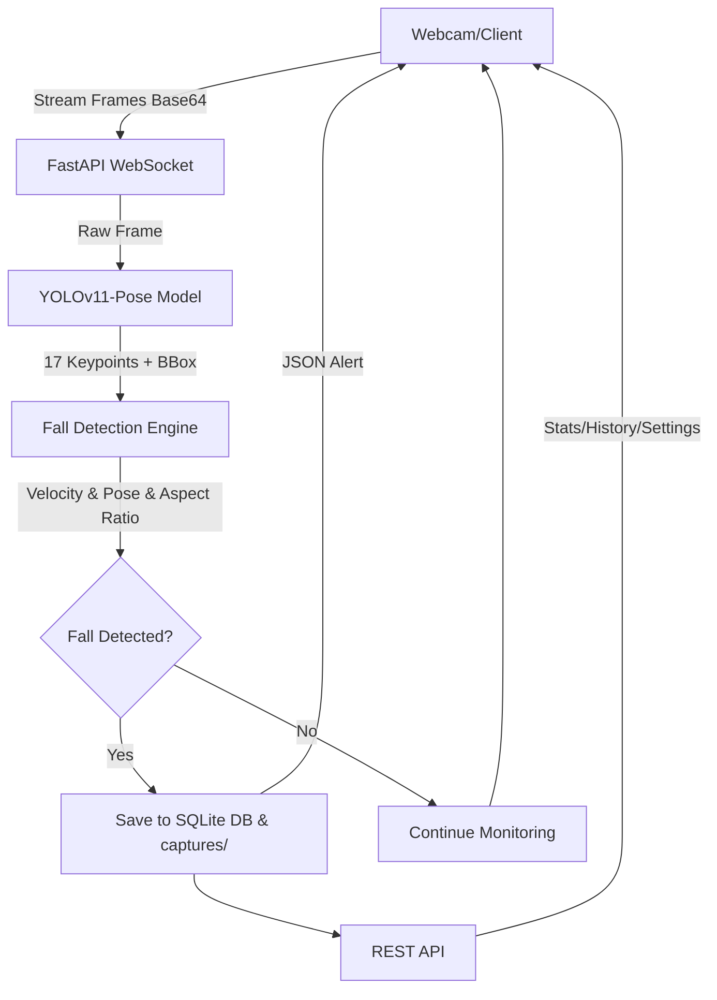

# System Architecture & AI Pipeline — FallGuard AI v2.0

## 1. Overall Architecture

Hệ thống thiết kế theo mô hình Client-Server, sử dụng WebSockets cho giao tiếp thời gian thực.



## 2. AI Processing Pipeline

```
Camera Frame (640×480)
    │
    ▼
┌──────────────────────────────────────┐
│  YOLOv11-Pose                        │
│  ├─ Object Detection (Bounding Box)  │
│  └─ Pose Estimation (17 Keypoints)   │
└──────────────┬───────────────────────┘
               │
               ▼
┌──────────────────────────────────────┐
│  Heuristic Fall Detection Engine     │
│  ├─ Velocity Analysis (hip dy/dt)    │
│  ├─ Aspect Ratio (width vs height)   │
│  ├─ Head-Hip Position Check          │
│  └─ Prone Counter (temporal filter)  │
└──────────────┬───────────────────────┘
               │
               ▼
┌──────────────────────────────────────┐
│  Post-Processing                     │
│  ├─ Cooldown Mechanism (10s)         │
│  ├─ Confidence Thresholding          │
│  └─ Alert Triggering                 │
└──────────────────────────────────────┘
```

## 3. Deep Learning Models (Training Pipeline)

Trained on SisFall dataset (4,510 recordings, 38 subjects):

| Model | Architecture | Parameters | Input |
|-------|-------------|------------|-------|
| Bi-LSTM + Attention | 2-layer LSTM, bidirectional, attention mechanism | ~200K | (batch, 200, 9) |
| GRU | 2-layer GRU, bidirectional | ~150K | (batch, 200, 9) |
| CNN-LSTM | 3-layer 1D-CNN + Bi-LSTM | ~180K | (batch, 200, 9) |

## 4. API Endpoints

| Method | Endpoint | Description |
|--------|----------|-------------|
| GET | `/api/health` | Server status & uptime |
| GET | `/api/stats` | Statistics (total, today, weekly, hourly) |
| GET | `/api/history` | Incident history (paginated) |
| DELETE | `/api/history/{id}` | Delete single incident |
| DELETE | `/api/history` | Clear all history |
| GET | `/api/export` | Export CSV |
| GET | `/api/settings` | Get current settings |
| POST | `/api/settings` | Update settings |
| WS | `/ws/detect` | Real-time detection stream |

## 5. Technology Stack

- **Backend**: Python 3.10, FastAPI, Uvicorn
- **AI/ML**: PyTorch, Ultralytics YOLOv11, scikit-learn
- **Frontend**: HTML5, CSS3 (Glassmorphism), Vanilla JS, Chart.js
- **Database**: SQLite 3
- **Communication**: WebSocket (real-time), REST API
